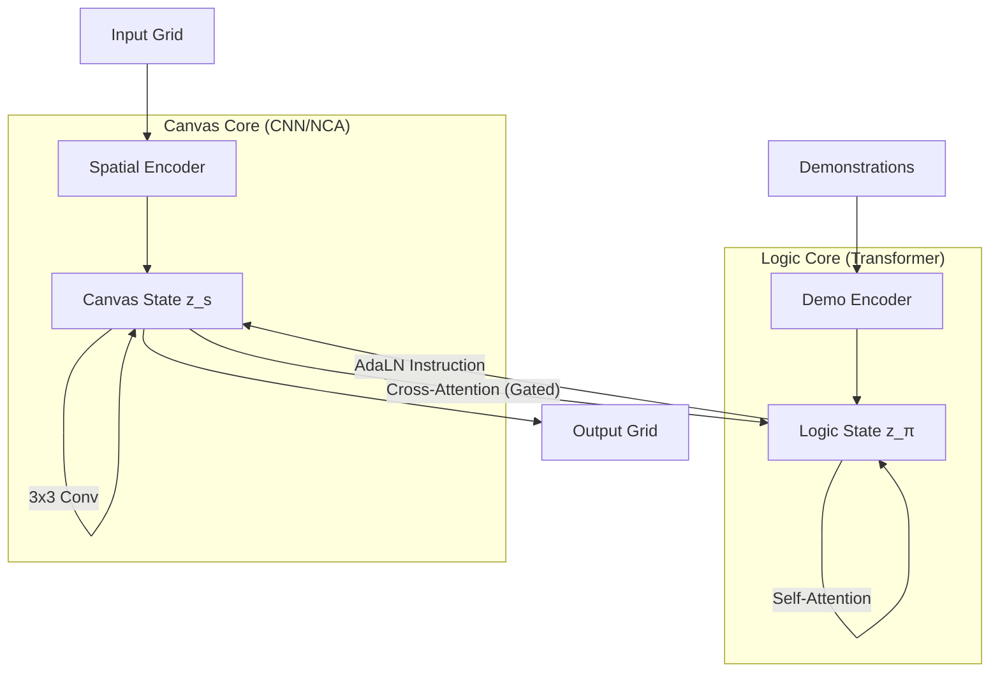

# TOPAS-DSPL: The Neural Core
### Dual-Stream Programmatic Learner

**Developed by Bitterbot AI**

[](https://zenodo.org/records/17834542)
[](https://zenodo.org/records/17683673)
[](https://opensource.org/licenses/MIT)

> **Abstract:** TOPAS-DSPL represents the **distilled neural essence** of the comprehensive TOPAS Neuro-Symbolic architecture. By stripping away the memory systems, symbolic rails, and the scaffolding of the full system, we isolate the specific contribution of the Dual-Stream Programmatic Learner (DSPL). Despite functioning here as a standalone neural baseline without neuro-symbolic aids, this streamlined core demonstrates remarkable robust reasoning, achieving a **24% Solve Rate** on the **ARC-AGI-2** public evaluation set. This validates the fundamental power of the **Bicameral Latent Space** independent of auxiliary scaffolding.

---

## The Vision: "Bicameral" Intelligence

Standard recursive models suffer from **compositional drift**: as the model iterates, it often forgets the algorithmic rule it is trying to execute because the state and the rule are mixed in a monolithic latent vector.

**TOPAS-DSPL** solves this by implementing a **Bicameral Latent Space** that mirrors the separation of brain functions and the Von Neumann architecture:

1. **Logic Stream (z_π) - The "Program":**
   - **Role:** Abstract algorithmic planning
   - **Behavior:** Acts as the CPU/Controller. It looks at the demonstrations (context) and the current state to issue "instructions"
   - **Invariant:** Evolves to refine the *rule*, not the pixels

2. **Canvas Stream (z_s) - The "Memory":**
   - **Role:** Spatial execution and state representation
   - **Behavior:** Acts as the GPU/RAM. It receives instructions via **Adaptive Layer Norm (AdaLN)** and executes local physics updates (NCA-style) on the grid
   - **Variant:** Evolves to reflect the *execution* of the rule

This separation allows the Logic Core to "reprogram" the Canvas Core dynamically at every recursive step, synthesizing hierarchical abstraction with recursive parsimony.

---

## Architecture Overview



### Key Features

- **Dynamic AdaLN Conditioning:** The Logic Core projects a dynamic "instruction vector" that modulates the weights of the Canvas Core, effectively compiling a new network for every timestep.

- **Test-Time Training (TTT):** The model "meditates" on the unique demonstrations of a test puzzle, optimizing its internal program tokens using Leave-One-Out Cross-Validation before generating a solution.

- **Test-Time Augmentation (TTA):** Robust inference using D8 dihedral group transforms and color permutations with majority voting.

- **MuonClip Optimizer:** Advanced optimization to handle the non-convex landscape of recursive deep learning.

- **Stream Dropout:** Regularization forcing Canvas to rely on Logic instructions, preventing the "lazy executive" failure mode.

---

## Hardware Configurations

TOPAS-DSPL is designed for **Recursive Parsimony**—achieving SOTA reasoning with tiny parameter counts (~8M - 24M). This makes it highly accessible while scaling efficiently on cluster hardware.

### Consumer / Enthusiast Setup

Perfect for development, debugging, and training "Tiny" or "Small" variants.

- **GPU:** NVIDIA RTX 4080/4090 (16GB+ VRAM)
- **Config:**
  - Batch Size: 8-16 per GPU
  - Gradient Accumulation: 88+ steps
  - Precision: AMP (fp16/bf16) enabled
- **Expected Speed:** ~2-4 iters/sec

### Research Grade Setup

Required for "Base" or "Large" variants and full 50k+ epoch runs.

- **GPU:** 4x-8x NVIDIA A100 (80GB) or H100
- **Config:**
  - Batch Size: 768+
  - Precision: bf16 recommended for recursive stability
- **Expected Speed:** ~15+ iters/sec (linear scaling via DDP)

### TPU Setup (Google Cloud)

For maximum throughput on the Base variant.

- **TPU:** v5e-8 (8 cores, 16GB HBM per core)
- **Config:** `config_topas_tpu.yaml`
  - Batch Size: 1024 per core (8192 effective)
  - Precision: Native bfloat16
 
```bash
# Install TPU dependencies
pip install torch_xla

# Launch training
python train.py --config config_topas_tpu.yaml --tpu
```

**Key TPU optimizations:**
- `ParallelLoader` for async data prefetching
- `xm.optimizer_step()` for gradient synchronization across cores
- Native bfloat16 precision (no AMP scaler needed)

---

## Getting Started

### 1. Installation

```bash
git clone https://github.com/Bitterbot-AI/topas-dslpv1.git
cd topas-dslp
python -m venv venv
source venv/bin/activate  # Linux/Mac
# or: venv\Scripts\activate  # Windows
pip install -r requirements.txt
```

### 2. Prepare Data

TOPAS-DSPL requires **1000 augmented puzzle groups** for training, generated using the TRM-style augmentation pipeline.

**Data Structure:**
```
data/
├── arc-agi_evaluation_challenges.json   # ARC-AGI-2 evaluation (120 tasks)
├── arc-agi_evaluation_solutions.json    # ARC-AGI-2 solutions
├── group_0000/                          # Augmented puzzle group
│   ├── puzzle_*.json                    # Multiple augmented versions
│   └── metadata.json
├── group_0001/
│   └── ...
└── group_0999/                          # 1000 groups total
```

**Setup:**

The **ARC-AGI-2 evaluation set** (120 tasks) is included in the `data/` folder of this repository.

```bash
# Generate augmented training data (1000 groups)
# Clone TRM repo and use their data builder:
git clone https://github.com/alexjm/TinyRecursiveModels.git
cd TinyRecursiveModels
python dataset/build_arc_dataset.py --output_dir ../data --num_groups 1000
```

Each group contains multiple augmented versions of a single ARC puzzle (D8 dihedral transforms + color permutations). All I/O pairs within a puzzle share the same augmentation to preserve demo consistency.

### 3. Training

```bash
# Single GPU (Consumer)
python train.py --config config_topas.yaml

# Multi-GPU (Research)
torchrun --nproc_per_node=4 train.py --config config_topas.yaml
```

### 4. Evaluation (with TTT)

Run the specialized evaluator with Test-Time Training:

```bash
python topas_evaluator.py \
  --checkpoint output_topas/checkpoints/best_model.pt \
  --challenges data/arc-agi_evaluation_challenges.json \
  --solutions data/arc-agi_evaluation_solutions.json \
  --ttt-steps 10 \
  --num-aug 8 \
  --output submission.json
```

---

## Configuration

Key parameters in `config_topas.yaml`:

```yaml
model:
  d_model: 480           # Hidden dimension
  n_heads: 8             # Attention heads
  H_cycles: 3            # Outer recursion cycles
  L_cycles: 4            # Inner recursion cycles per H
  L_layers: 2            # Layers per core

training:
  batch_size: 16         # Local batch size
  accumulation_steps: 88 # Effective batch = 16 × 88 = 1408
  epochs_per_iter: 10    # Passes through data per epoch
  learning_rate: 0.0001

regularization:
  ema: true              # Exponential Moving Average
  ema_decay: 0.999
  stream_dropout: 0.1    # Forces Canvas to use Logic instructions
```

### Model Variants

| Variant | d_model | Parameters | Use Case |
|---------|---------|------------|----------|
| tiny    | 256     | ~3.5M      | Fast prototyping |
| small   | 384     | ~15M       | Consumer hardware default |
| **base**| **480** | **~24M**   | **24% solve rate achieved** |
| large   | 640     | ~43M       | Maximum performance |

> **Note on reported results:** The **24% solve rate** on **ARC-AGI-2** public evaluation was achieved using the **Base (~24M)** configuration with `d_model=480`. The repository defaults to this configuration.

### Implementation Notes

**Dimension Choice:** The paper describes an idealized architecture with `d_model=512`, but during final training runs we settled on `d_model=480` which allows clean head division (480/8=60) and optimizes GPU memory utilization.

**Parameter Growth:** The ~24M count in Base reflects the dual-stream architecture (separate Logic + Canvas cores) and the depth required for stable recursive loops.

**Optimizer Deviation:** A critical change from the paper is the migration from AdamW to the **MuonClip optimizer** (Momentum-Orthogonalized updates). This significantly stabilized gradients through deep recursive steps compared to vanilla AdamW.

---

## Monitoring

Training logs to TensorBoard:

```bash
tensorboard --logdir output_topas/logs
```

Key metrics:
- `train/loss`: Should decrease steadily
- `train/accuracy`: Pixel-level accuracy (expect 70-100% mid-training)
- `eval/accuracy`: Full puzzle solve rate

---

## Project Structure

```
topas_dslp/
├── config_topas.yaml      # GPU training configuration
├── config_topas_tpu.yaml  # TPU training configuration
├── train.py               # Main training script
├── topas_dslp_model.py    # TOPAS-DSPL model architecture
├── topas_evaluator.py     # TTT + TTA evaluation
├── logic_core.py          # Logic Stream transformer
├── canvas_core.py         # Canvas Stream CNN/NCA
├── puzzle_dataset.py      # ARC data loading
├── visualization.py       # Grid visualization utilities
├── logger.py              # TensorBoard logging
├── ema.py                 # Exponential Moving Average
├── muonclip.py            # MuonClip optimizer
└── data/                  # Training data directory
```

---

## Theoretical Background

### The Synthesis

DSPL synthesizes insights from two paradigms:

### Key Insight

> *HRM fails because its separation is temporal (Fast/Slow), which is an imperfect proxy for the true functional separation needed (Rule/State). TRM fails on ARC-AGI-2 because it collapses Rule and State into a single vector, causing "compositional drift."*

DSPL implements **functional separation**: the Logic Stream maintains the algorithm while the Canvas Stream maintains the execution state—mirroring the Turing machine's separation of Program from Memory Tape.

---

## References & Citation

If you use this codebase in your research, please cite:

### The Dual-Stream Programmatic Learner (DSPL)
Foundations of the Bicameral Latent Space and dynamic conditioning.

[Read on Zenodo](https://zenodo.org/records/17834542)

### The TOPAS Architecture
The complete Neuro-Symbolic Hybrid Architecture specification.

[Read on Zenodo](https://zenodo.org/records/17683673)

```bibtex
@misc{gil2025dspl,
  title={The Dual-Stream Programmatic Learner},
  author={Gil, Victor Michael},
  year={2025},
  publisher={Zenodo},
  doi={10.5281/zenodo.17834542},
  url={https://zenodo.org/records/17834542}
}

@misc{gil2025topas,
  title={TOPAS: Neuro-Symbolic Hybrid Architecture},
  author={Gil, Victor Michael},
  year={2025},
  publisher={Zenodo},
  doi={10.5281/zenodo.17683673},
  url={https://zenodo.org/records/17683673}
}
```

### Foundational Works

- [Hierarchical Reasoning Model (HRM)](https://arxiv.org/abs/2506.21734) - Wang et al., 2025
- [Tiny Recursive Models (TRM)](https://arxiv.org/abs/2510.04871) - Jolicoeur-Martineau, 2025
- [ARC-AGI Benchmark](https://arcprize.org/) - Chollet, 2019

---

## Acknowledgments

- **Tiny Recursive Models (TRM):** For the proof that "Less is More" in recursive reasoning
- **ARC Prize Foundation:** For providing the ultimate benchmark for General Intelligence
- **TRM Codebase:** For data augmentation pipeline and sparse embedding implementation

---

## License

MIT License - see LICENSE file for details.
